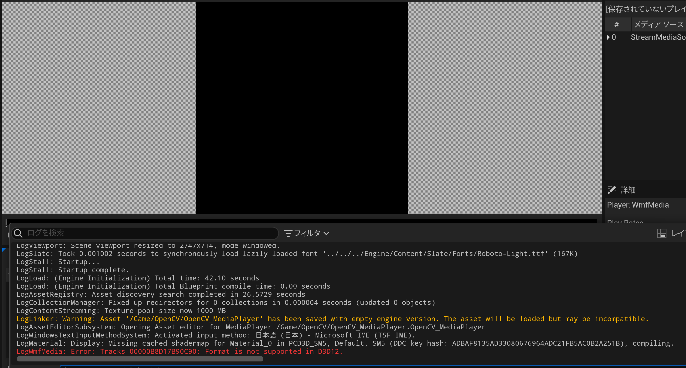
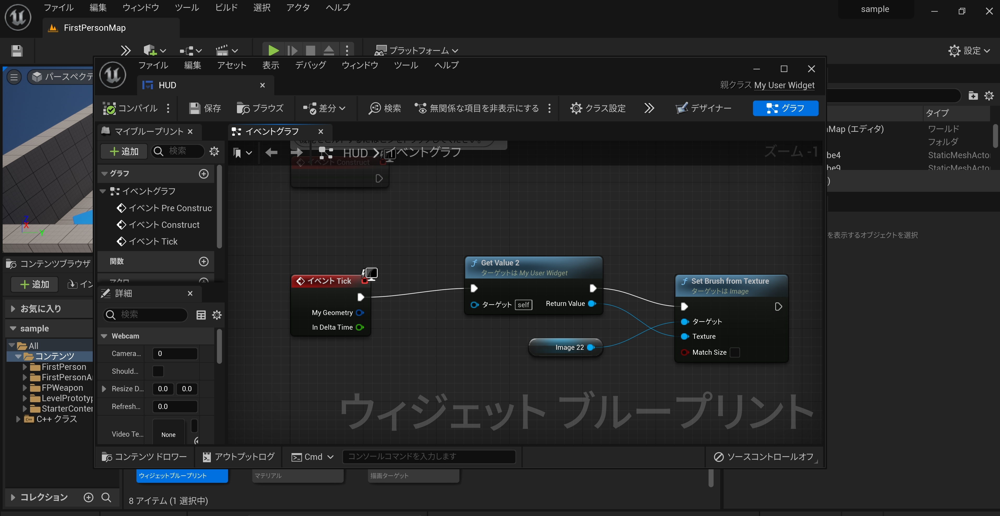

# How to use Webcam in (UE5)Unreal Engine 5 
## introduction
UE5は現在DirectX12でMediaPlayerでのwebcamを使うことができないようです。このレポジトリではOpenCVのcv::Videocaptureの機能を使うことでMediaPalyerの代わりとして解決する方法を示します。このエラーはUE5.1で改善されることが公式でいわれていますので、気長に待つことも解決策の一つと言えます。

### Attention
MediaPlayerの代わりとしてOpenCVを使いますが、MediaPlayerと同じ使い方ができません。ソースコードとBPを自分で変更することで自分用にカスタマイズしてください。

## Product
このリポジトリで作成したものはHUDにWebcameraからキャプチャした映像をそのまま表示するものです。OpenCVではキャプチャした映像以外にも動画や画像も読み込むことができるので、その時は各自がコーディングしてください。

## Step1
既にUE5.03がインストールされていることを前提に進めます。まずは、プロジェクトを作成します。分かりやすいように私はゲームのfirst personのサンプルを使用します。作成時にはプロジェクトデフォルトでC++を選んでおいてください。名前は何でもいいですが、このリポジトリのコードをコピペするときはプロジェクト名の部分を変更しなければなりません。

## Step2
Step1で作成した後にそのプロジェクトが立ち上がります。このステップでは、そのプロジェクトでOpenCVを使えるようにします。編集->プラグインでプラグインのウィンドウを開きます。「opencv」で検索するとOpenCVが見つかるので、チェックボックスをクリックしてチェックを入れる。このままだとまだOpenCVは湯有効になっていないので、右下のに出てきた「今すぐ再起動」をクリックしてプロジェクトを再起動してください。
OpenCVがベータ版の時、メッセージが出ますが気にせず「はい」を押してください。

## Step3
次に、UE側で必要なものを作成する。まず、ユーザーインターフェースのウィジェットブループリントを作成する。名前は「HUD」としてそれを開きます。パレットからImageを探し右にドラッグアンドドロップします。すると、左の階層にImage_60が現れるので、それを左クリックしてください。最後に、...でラップする->Canvas Panelをクリックして、ImageをCanvas Panelでラップします。Imageが小さくなるはずなので、好きな大きさに拡大してください。次に、マテリアルと描画ターゲットを追加します。

## Step4
このステップではコードを変更します。ツールからVisual Studioを開きます。このリポジトリのコードを利用して適切な場所にコピペしてください。まずは、.Build.csに変更を加えてコンパイルしてください。一度に全ての変更を加えるとエラーが出ます。コンパイルするとプロジェクトがたちあがるので、ツール->新規C++クラスを選択する。親クラスを選択するときは「全てのクラス」をクリックし、「userwidget」を検索してUserWidgetを選択する。そのクラスの名前もプロジェクト名同様に好きに命名する。また、そのUserWidgetのコードを変更します。

## Step5
ブループリントを変更する前に、作成したHUDの親クラスを変更します。HUDを開き、グラフ->クラスの設定を押し、左の詳細から親クラスを先程作成したクラスに変更します。

## Step6
最後にブループリントを変更します。まずはStep3で作成したマテリアルを変更します。HUDのウィンドウでは下の写真のようにします。このときに、マテリアルエクスプレッションテクスチャーベースのテクスチャーにStep3で作成した描画ターゲットを割り当てます。

次に、HUDを開き、Imageの割り当てられているものを先程変更したマテリアルにします。そして、HUDのブループリントを下の写真のようにします。

最後に、レベルブループリントを開き、下の写真のようにします。
